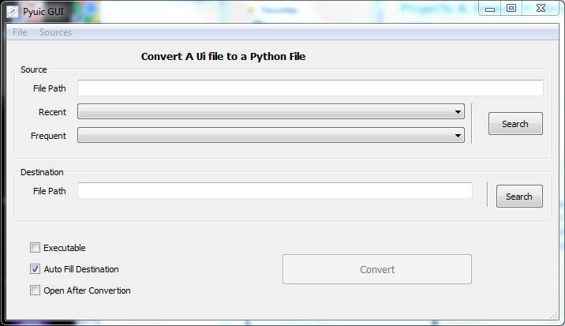

# PYUIC GUI Converter PyQt
 A Gui application based on pyqt4 that converts ui files generated from QtDesigner to python python file
 
## Installation ##

The current vertion here uses pyqt5 hence you will need pyqt5 and pyqt5 tools as shown bellow...
```
pip install pyqt5
pip install pyqt5-tools
```
## Preview ##

1. Frontend of the GUI.



2. Editor selection dialog for the editor used to preview the converted ui file after convertion.


